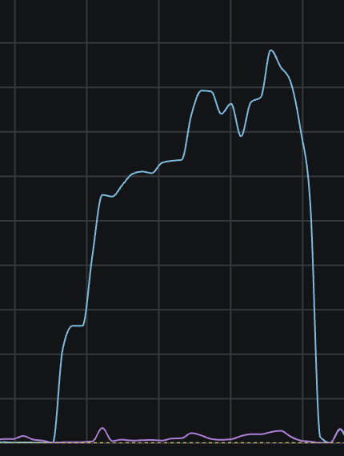

Starting at 01:21:32 (all times are UTC) on the 26th of December 2025 and ending at 22:38:02 on the 27th of December, a Virtual Machine running out of storage caused partial degradation of internal services which eventually resulted in ~800GB of data being downloaded in just over 24 hours, and the Games Society's Minecraft server falling offline.

We would like to apologise for this incident. As a service provider to Clubs and Societies in TU Dublin, our goal is to maximise uptime and service quality. At the end we will go over how we will work to reduce the chance of incidents occurring to provide a better service to the Clubs and Societies and the 28,000+ students in TU Dublin.

This post-mortem will not be in chronological order and instead focus on the series of events, jumping around the incident window as needed.

# 27/12 @ 20:28 - "em"

At 20:28, @relyt, one of our Sysadmins at CS++ remarked that our internal Sysadmin homepage was offline. This could've been caused by one of many issues, such as Tyler's VPN not being active, or a DNS priority issue. The latter is something we've seen occasionally appear in our internal-only services and is a low-priority item to fix.

While noted as out-of-the-ordinary, the external services were still routable, so this problem was not investigated further.

In reality, this issue was a symptom of the real problem, `Huey`, the VM used to host CS++'s services in our cluster had ran out of space on its disk and this was impacting containers that interacted with the filesystem.

# 27/12 @ 22:05 - "completely Unrelated to cs++"..

At 22:05 on the 27th, a message was sent to me from @rockerkemm, another of our Sysadmins.

As it turned out, not only was it not hypothetical, it was *also* related to CS++.

# 27/12 @ 21:34 - "**Server Has stopped**"

At 21:34 the Game Soc Minecraft Server (`mc.gamesoc.ie`) went offline. This was caused by the Minecraft Server trying to pull the latest plugins from `zipline`, an internal file-hosting tool that we use to make it easy to manage the plugins for the Minecraft Server.

This failure occurred because the database sidecar container used by Zipline crashed due to it not being able to write to disk, as the disk had become full.

With Zipline offline, when the Minecraft server attempted to pull the plugins, it received an error. The server is designed to fail safe and avoid potential world corruption, so stopped the server instead of attempting to load without some plugins.

With the MC server now offline, @rockerkemm was pinged by Game Soc committee and began triaging the problem.

# 27/12 @ 22:18 - "WTF"

A call began to triage the issue. The root cause of the out-of-space issue was that Docker containers had filled the space with logs, causing partial degradation. This included some users being unable to sudo, DNS resolution internally failing and erroneous network use.

Huey's disk was resized, and unused containers were fully cleared to increase available disk space. This resolved the issue and all services, internal and public-facing, came online without issue.

# 27/12 @ 22:52 - "752GB? That Can't Be right."

Once the main issue was resolved, the rest of the infrastructure was inspected to see if any additional issues arose that were hidden by the main incident. During a check of the networking infrastructure, an outlier was found.

From 01:00 on the 26th of December until 04:00 on the 27th of December, Huey downloaded 752GB of data from GitHub. At it's peak, Huey alone was downloading unknown content from GitHub at nearly 400Mbps, 40% of our bandwidth.

# Wacky Containers or Security Incident?

Publicly hosting any services automatically increases your attack surface. Instead of just having your router as a vulnerability, now every service's vulnerability becomes another attack vector.

Any anomalous activity on a system or network could be due to an exploited vulnerability, and with the recent [10.0-rated vulnerability in React](https://nextjs.org/blog/CVE-2025-66478) which impacted **7% OF THE INTERNET**, any service we expose that uses React could be at-risk or already taken over.

CS++ uses Docker containers due to their portability and natural security. In theory, a compromised container would not pose a significant security risk. *unless* it was connected to host services like the Docker Socket.

CS++ takes security very seriously and investigated the root cause as a panicking Watchtower container.

Watchtower is a container which is used to automatically update other Docker containers. It regularly polls the container image registry where that container image comes from for newer versions and installs them if a new version is released. This is a core part of CS++'s CI/CD pipeline to automate deployments for software like MorningBot and Plume, our website.

We concluded that when Huey ran out of space, Watchtower became partially degraded and was unable to verify that it had the latest version of container images, and began to consistently pull down all the images on Huey every time it checked for updates.

We're still investigating why Watchtower stopped after 27 hours, but our preliminary conclusion is that the container fully crashed.

# Why Didn't We Know Sooner?

Monitoring and Alerting has not been fully implemented into our infrastructure yet. Because of this, the early warnings and symptoms were unnoticed until a priority service (Game Soc Minecraft Server) went offline.

This was an oversight on our part, and we apologise.

# What We're Doing

With full services restored, we have refocused to improve the monitoring and alerting systems we use at CS++ to help us identify potential problems before they happen and be aware of and resolve incidents when they start.

Over the last few months, we've worked to harden our infrastructure and make it both more secure and fault-tolerant. Through high-availability of data and compute, as well as a recent networking upgrade for our data, CS++'s infrastructure can handle most software and hardware failures without a significant impact on services.

While our intentions were good, our neglect of monitoring and alerting allowed this incident to occur and identified a hole in our infrastructure which we are now focusing on fixing.

# Blameless, Always Blameless

As our first post-mortem, it is important to discuss how we approach incidents and their post-mortem.

At CS++, for both technical and non-technical incidents, we apply a blameless approach to post-mortems. The organisation and operations have failed, not a person.

This approach is common in the industry and results in a more honest and trusting relationship between peers, and focuses on resolving the real issue as opposed to blaming someone.

Humans make mistakes, and a system should be designed to embrace that and be fault-tolerant.

When an incident occurs we look at not who caused it, but how can we make sure it does not happen again. This approach empowers people and makes it harder to make the same mistake again, as the system is now designed to catch it before it happens.

# Conclusion

CS++ is committed to building the best student-led hosting infrastructure in the country. Every incident is a learning experience for us to improve our systems and make it easier for clubs and socs to host services that improve the Student Life in TU Dublin.

This incident has helped us prioritise what we need to do next to get closer to achieving our goal. We apologise again for the service interruptions, and will work to reduce future incidents.
