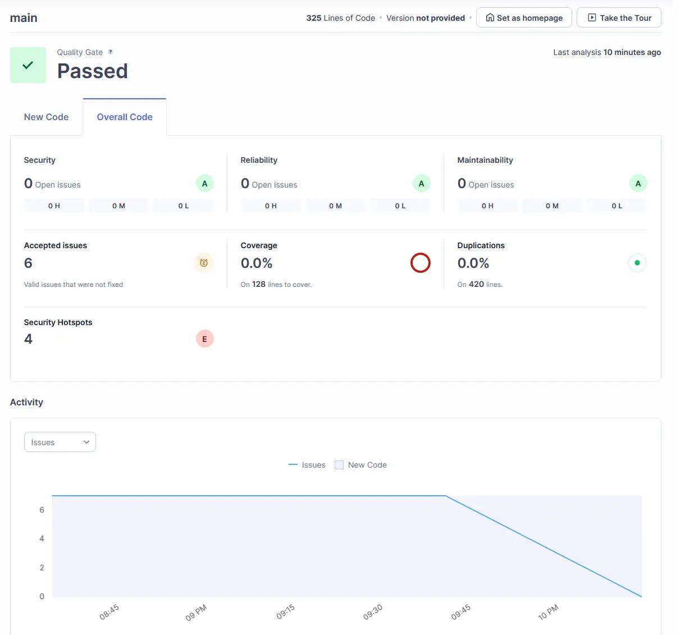

In industry, tests, linting and security analysis is a requirement to ensure secure, robust, and well-written code.

It stops mistakes made by developers which can bring down production, or make the product vulnerable.

[SonarQube](https://sonarqube.com) is a commonly used code quality system that just so happens to have a Community Edition!

# Why Does CS++ Need It?

As we start to develop bespoke software that becomes more critical to the society, like Plume (Which we've written about [here](stealing-from-redbrick.md)), it becomes important that the project is secure, and won't collapse during deployment.

We've had a few occasions where we've pushed unfinished features, broken links, and broken images to Plume, so we want to start making sure that doesn't happen. Especially as Plume becomes the face of the society.

SonarQube is really simple, it runs as a Docker Container, and we connect it to a GitHub Workflow that runs every time a commit is made to the repository.

For any repositories with CI/CD (For automatic deployment), SonarQube passing is a requirement for the project to be deployed.

The User Interface is really useful, too:

This is some actual usage metrics from SonarQube about Plume!

We currently have no issues with Security, Reliability or Maintainability. Which means we're adhering to correct programming principles, and haven't exposed anything vulnerable.

*But wait! It says you have 4 'Security Hotspots'!*
Yes it does! Hotspots are not genuine security issues, but a step that requires the developer to manually review that this security-sensitive code is safe.

None of the hotspots raised present a significant problem, but haven't been marked as 'resolved' when this screenshot was taken.

# Any Other Quality Checks?
The plan is to create and roll out a few analysis workflows that will do the following:
- Spell-check
- Link resolution
- Image Source verification
These will be stored in a dedicated, public repository, and for new projects can just be easily integrated without having to develop specific actions for each repository.

We're really lucky to have no tech debt as a society, so we can build strong, universal test tooling without having to write hyper-specialised tests for each project we have!